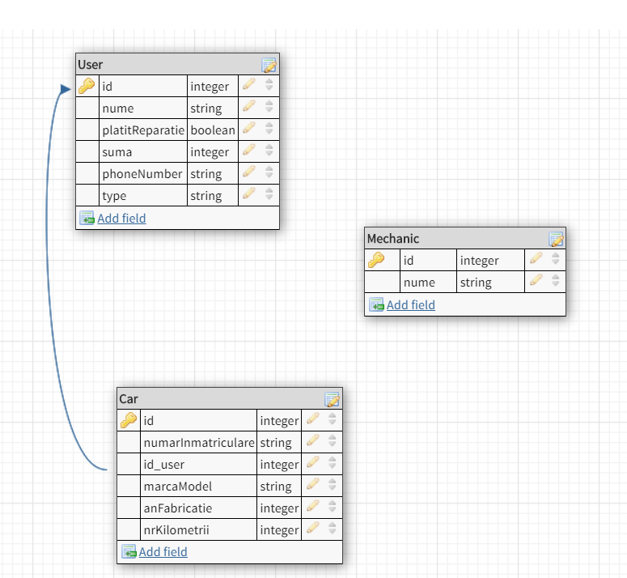
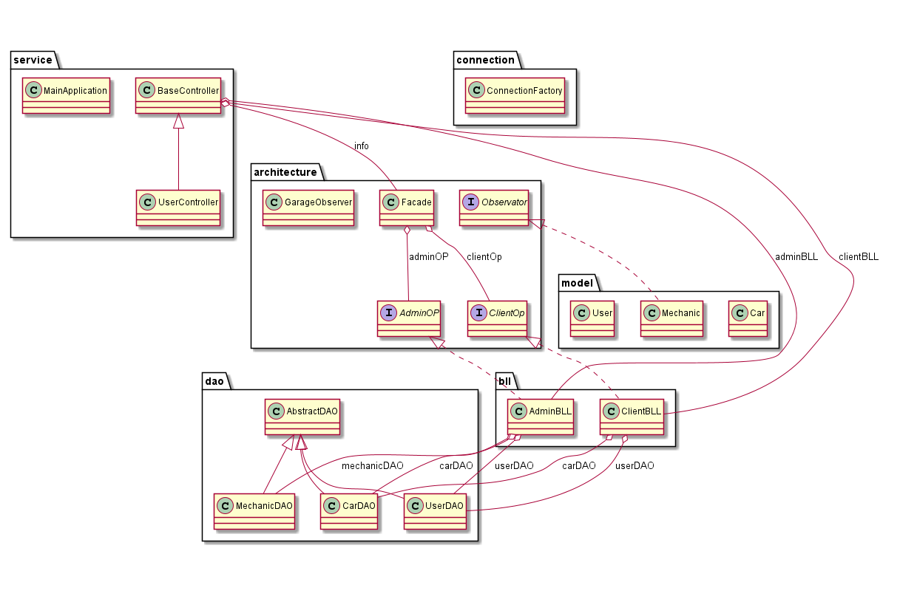

# Garage Booking System

## Descrierea temei
Aplicatia doreste sa fie un sistem integrat pentru gestionarea rezervariilor la nivelul unui service auto. Pentru dezvoltarea acesteia se va folosii limbajul de programare Java, framework-ul Spring iar Design Pattern-urile Facade, DAO, Singleton, Observer(de dezvoltat), totul va fi stocat in o baza de date.

## Utilizatorii aplicatiei
Acestia se impart in doua categorii: Client, Admin(un singur admin in mod normal). 
##### Administrator
Acesta are drepturi depline asupra gestionarii bazei de date avand dreptul sa modifice toate campurile.
##### Client
Clientul are drepturi limitate la baza de date, doua insert-uri si un update. 

## Implementare

In faza initiala am adugat doar 3 tabele urmand ca ulterior sa adaug inca cateava tabele pentru rezolvarea legaturilor intre tabele: Car, Mechanic, User.
Aplicatia a fost organizata in pachete acest fapt ii confera lizibilitate.
S-a utilizat design pattern-ul Observer pentru notificarea mecanicilor la intrarea unei noi masini in service.
Am folosit Mockito pentru testarea aplicatiei.

## Diagrame

##### Diagrama bazei de date

##### Diagrama de clase
